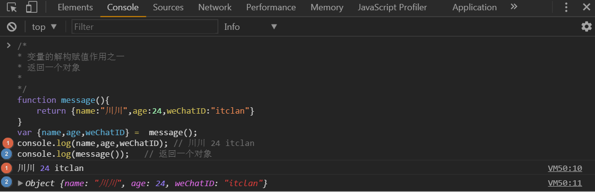

### Es6中变量的解构与赋值

### 前言

离上一篇Es6的`念念不忘的Es5,跃跃欲试的Es6`的文章过去很久了,对于Es6的学习着实有些缓慢,新出来的小程序,越来越开放,越来越给力,令人骚动,各种流行的前端框架也总能让你停下脚步,跃跃欲试,终归结底来说,前端技术日新月异,现在出去面试,也基本都会问你Es6的一些内容了,越来越多的项目已经在用了的,这已是必然的趋势,无论是抱守Es5,还是现学Es6,Es7,时间也都会推着我们前进,今天一起来学习一下`变量的解构赋值`,本篇并不涉及什么高大上的内容,针对初学者,毫无压力,但需要对ES5的定义变量`var关键字`,`数组`,`对象`有所熟悉,对Es6新增的`let,const`有所了解,下面就我的学习和使用,跟大家分享一下使用心得,感受Es6不一样的魔力与强悍

>### 什么是数组

示例代码如下

```
  var arr = [1,true,"itclan",null,undefined,function(){}],
     a = arr[0],
     b = arr[1],
     c = arr[2],
     d = arr[3],
     e = arr[4],
     f = arr[5]
  console.log(arr);//[1,true,"itclan",null,undefined, function]
  console.log(a,b,c,d,e,f); //1 true "itclan" null undefined (){}
```
`官方解释`:一组有序列值的集合
`直白解释`:按照次序排列的一组值,每一组中的值又叫做元素,元素与元素之间用逗号隔开,每个值在这个集合中都有一个位置,也就是对应的编号,以数字表示,从0开始,通常称为索引
`特点:`

* 除了`boolean`,`null`,`undefined`,`函数`之外,遇到字符串时,需要用单引号和双引号给包裹起来,注意number不用
* 无类型的,数组元素可以是任意类型,可以是`number`,`boolean`,`null`,`undeinfed`,`对象`,`数组`,`函数`等可构成一复杂的数据结构

> ### 什么是解构

`官方定义`:按照一定的模式,从数组和对象中提取值,对变量进行赋值,这被称为解构(是针对数组或者对象中的值的提取和解析,在原有的结构基础上按照一定的规则进行重新定义结构,使变量赋值更为直观简单) 
`直白解释`:模式匹配,映射关系,只要等号两边的模式相同,一一对应,左边的变量就会被赋予对应的值 
代码示例

```
var [a,b,c,d,e,f] = [1,true,"itclan",null,undefined,function(){}]
console.log(a,b,c,d,e,f);
```
控制台测试结果输出


>### let与const命令同样适用解构赋值

示例代码如下:

```
let [name,[[publicNum],sex]]=["随笔川迹",[["itclan"],"boy"]]
const [book,[[weChat],age]]=["javascript",[["suibichuanji"],24]];
console.log(name,publicNum,sex);
console.log(book,weChat,age);
```
控制台结果输出

* 可以适用嵌套数组进行解构
* 拓展运算符`...`

示例代码如下

```
/*
*  拓展运算符:
*  1. 可以对一个数组进行拆分
*  2. 它是基于那些有遍历接口的
*  3. 拓展运算符:是三个点,它好比rest参数的逆运算,将一个数组转换为用逗号分割的参数序列,该运算符主要用于函数调用
*
*/   
let [first,...tail] = ["itclan",true,null,undefined,3,4,5];
let [x,y,...z] = [1];
let [,,,,last] = ["one","two","three","four","five"];
console.log(first);    // itclan
console.log(tail);     // true,null,undefined,3,4,5
console.log(last);     // five
console.log(x,y,z);    // 1 undefined []
```
控制台测试结果输出


`注意`:
1.  可以对一个数组进行拆分
2.  它是基于那些有遍历接口的
3.  拓展运算符:是三个点,它好比rest参数的逆运算,将一个数组转换为用逗号分割的参数序列,该运算符主要用于函数调用
4. 解析不成功,变量的值就等于undefined(等式左边变量与等式右边变量值不对等的话,不对等的变量会变为undefined,相当于只声明变量,并没有赋值),若右边值多于左边变量数,多于的会被舍弃掉,但是有一种情况是不完全解构,即等号左边的模式只匹配等号右边变量值的一部分,这种情况解构依然是可以成功的,这种情况为不完全解构

示例代码如下

```
/*
* 解构不成功,变量的值为undeined
*
*/
 var [name] = [];
 var [age,sex] = ["随笔川迹"];
 var [book,author]=["javascript框架设计","司徒大大","宅神","二次元"];
 var [x,[m],z] = [0,[1,2],3];
 console.log(name,age,sex,book,author,x,m,z);
```
`控制台测试结果输出`

于其他出现undefined情况,你可以戳前文:[精要javascript中的函数]()
> 等号右边不是数组(不是可遍历的结构),或是不具备可枚举(Interator)的接口,要么本身就具备Iterator接口

代码示例如下:

```
/*
* 以下情况：不具备interator接口,和本身不具备interator接口,解构不成功
*
*/
let [x] = 2;
let [y] = true;
let [m] = NaN;
let [n] = undefined;
let [p] = null;
let [o] = {};
// Uncaught TypeError: undefined is not a function
```
上面的表达式都会报错,左右等式两边若类型不对等的话,都会报错
> ###允许指定默认值

示例代码如下

```
/*
* 允许指定默认值
* 注意:当等号右边的值为undefined时,是不会覆盖默认值的
*
*/
let [x,y,z = "itclan"] = [1,2]
let [m,n,q = 0] = [3,4,5];
let [foo = true] = [];
let [j,k='b'] = ["123",undefined];
let [l = 1,i = l] = [];
let [w = 1,e = w] = [3];
let [t = 1,b = t] = [4,5];
//let [h = v,v = 2] = [];
console.log(x,y,z);      // 1 2 "itclan"
console.log(m,n,q);      // 3 4 5
console.log(foo);        // true
console.log(j,k);        // 123 b
console.log(l,i);        // 1 1
console.log(w,e);        // 3 3
console.log(t,b);        // 4 5
//console.log(h,v);v is not defined
```
控制台测试结果输出

> ###对象的解构赋值

解构不仅适用于数组,还可以用于对象
* 注意:对象的解构与数组有一个重要的不同,数组的元素是按照次序排列的,变量的取值由它的位置决定,而对象的属性没有次序,变量必须与属性同名,才能取到正确的值
* 等号左边的变量与等号右边的两个同名属性不一致,但是对取值完全没有影响
* 变量没有对应的同名属性,导致取不到值,最后等于undefined
* 对象的解构赋值的内部机制,是先找到同名属性,然后在赋给对应的变量,真正被赋值的是后者,而不是前者

代码示例如下

```
/*
* 对象的解构赋值
* 解构不仅适用于数组,还可以用于对象
* 注意:对象的解构与数组有一个重要的不同,数组的元素是按照次序排列的,变量的取值由它的位置决定,而对象的属性没有次序,变量必须与属性同名,才能取到正确的值
* 1. 等号左边的变量与等号右边的两个同名属性不一致,但是对取值完全没有影响
* 2. 变量没有对应的同名属性,导致取不到值,最后等于undefined
* 3. 对象的解构赋值的内部机制,是先找到同名属性,然后再赋给对应的变量，真正被赋值的是后者,而不是前者
 * 
 */
 let {name,sex} = {name:"暖暖",sex:"妹子"}
 let {a,b,c,d} = {a:1,b:2,c:3,d:4}
 let {x,y,m,n} = {y:5,x:6,n:"cidy",m:"mini"};
 let {k} = {f:"fff",h:"hhh"}
 let {book:javascript} = {book:"锋利的jQuery",author:"xxx大神"};
 let obj = {firstName:"li",LastName:"shi"};
 let {firstName:f,LastName:L} =  obj; 
 let {var1:var1,var2:var2} = {var1:"aaa",var2:"bbb"}
 let {fun1:fun2} = {fun1:"AAA",fun2:"BBB"}
 console.log(name,sex);   //暖暖 妹子
 console.log(a,b,c,d);    //1 2 3 4
 console.log(x,y,m,n);    //6 5 "mini" "cidy"
 console.log(k);          //undefined
 console.log(javascript);//锋利的jQuery
 console.log(obj);    //Object {firstName: "li", LastName: "shi"}
 console.log(f,L);     //li shi
 console.log(var1,var2); // aaa bbb
 console.log(fun2);      // AAA
```
控制台测试结果输出:


> ###对象的解构与数组一样,同样可以嵌套

注意如下示例line是变量,loc和start都是模式,不会被赋值
* 对象的解构可以指定默认值
* 默认值生效的条件是:对象的属性值严格等于undefined,导致默认值不会生效,如果解构失败,变量的值等于undefined

示例代码如下

```
/*
* 对象的解构与数组一样,同样可以用于嵌套结构的对象
* 注意line是变量,loc和start都是模式,不会被赋值
* 对象的解构也可以指定默认值
* 默认值生效的条件是:对象的属性值严格等于undefined,导致默认值不会生效,如果解构失败,变量的值等于undefined
* 
*/
var obj = {
        p:[
            "suibichuanji",
            {y:"itclan"}
          ]
};
var {p:[x,{y}]} = obj;
var ExpObj = {
           loc:{
               start:{
                   line:1,
                   colum:4
               }
           }
}
var {loc:{start:{line}}} = ExpObj;
// 下面是嵌套赋值的例子
var obj = {};
var arr = [];
({fun1:obj.proms1,fun2:arr[0]} = {fun1:234,fun2:false})
// 对象的解构也可由指定的默认值
let {w = 4} = {};
let {e,r=5} = {e:1}
// 默认值生效的条件是:对象的属性值严格等于undefined
let {t:message="weclome to itclan public Number"} = {};
let {u = 5} = {u:undefined}
let {i = 4} = {i:null}
console.log(x);            // suibichuanji
console.log(y);            // itclan
console.log(line);         // 1
//console.log(loc);        // loc is not defined
//console.log(start);      // start is not defined
console.log(obj,arr);      // Object {proms1: 234} [false]
console.log(w);            // 4
console.log(e,r);          // 1 5
console.log(message);      // weclome to itclan public Number
console.log(u);            // 5
console.log(i);            // null
```
控制台测试结果输出


> ###字符串的解构赋值 

```
示例代码如下
/*
* 字符串也可以解构赋值,这时因为,此时字符串被转换成了一个类似数组的对象,类似数组的独享都有Length属性,所以依然可以对这个属性解构赋值
*
*/
window.onload = function(){
    var [a,b,c,d,e,f,h] = "大家好我是川川";
    let [q,w,r,t] = "随笔川迹";
    const [m,n,s,g,k,v] = "itclan";
    var {length:len0} = "微信itclan公众号"
    let {length:len1} = "javascript权威指南";
    const {length:len2} = 123;
    var {length:len3} = {name:"suibichuanji",sex:"boy"}
    var {length:len4} = function(q,x){}
    console.log(a,b,c,d,e,f,h);  // 大 家 好 我 是 川 川
    console.log(q,w,r,t);        // 随 笔 川 迹
    console.log(m,n,s,g,k,v);    // i t c l a n
    console.log(len0);           // 11
    console.log(len1);           // 14
    console.log(len2);           // undefined
    console.log(len3);           // undefined
    console.log(len4);           // 2
}
```
控制台测试结果输出


`注意`
* let,const对同一个变量不能重新声明,且必须先声明赋值，才能使用,否则会报错
* 数字,对象无长度,但是函数有长度,且当无形式参数时,长度为0,它的长度由形式参数的个数而定,对于不可枚举循环遍历的对象,操作对象下面的方法时,无法用for循环,可以用for-in来操作对象循环遍历属性

> ###数值和布尔值的解构赋值

解构赋值时,如果等号右边是数值或布尔值,则会转换为对象
* 数值和布尔值的包装对象都具有toString属性,因此变量str,boo都能取到值
* 解构赋值的规则是:只要等号右边的值不是对象,就先转换为对象
* 注意:undefined,null无法转换为对象,所以对他们进行解构赋值都会报错 
示例代码如下

```
/*
*  解构赋值时,如果等号右边是数值或布尔值,则会转换为对象
*  数值和布尔值的包装对象都具有toString属性,因此变量str,boo都能取到值
* 解构赋值的规则是:只要等号右边的值不是对象,就先转换为对象
* 注意:undefined,null无法转换为对象,所以对他们进行解构赋值都会报错
*
*/
let {toString:str} = 1234;
let {toString:boo} = true;
console.log(str);
console.log(str === Number.prototype.toString);
console.log(boo === Boolean.prototype.toString);
let {propX:x} = undefined;
let {propY:y} = null;
console.log(x);
console.log(y);
```
控制台输出结果

> ### 函数参数的解构赋值

示例代码如下

```
/*
* 函数的参数也可以解构赋值
*
*/
/*原始方法,传递数组*/
var arr = [2,4];
function multiply1(x,y){
    return x*y;
}
/*使用函数参数解构赋值*/
function multiply2([x,y]){
    return x*y;
}
console.log(multiply1(arr[0],arr[1]));    // 8
console.log(multiply2([2,4]));            // 8
```
控制台测试结果输出

 

面的两段代码分别是没有使用解构赋值,和使用了解构赋值,前一个呢,是通过函数直接传参的形式,后一个呢,你可以理解为将圆括号内作为整个参数,传进去,函数multiply2的实际参数并不是一个数组,而是通过解构得到的变量x,y 
`两者性能比较`:执行代码所消耗的时间,从结果得出，前者要优于后者,后者只是一种代码书写的简化，后者消耗的时间长一点,小段代码性能差别并不是很大,不受影响,但是若是很多的话,也是影响性能的,因为它先要解构,在赋值嘛,语法糖虽新,简化了操作,必然牺牲性能,有得必有失,适用就好


> 函数的参数的解构也允许适用默认值

函数result的参数是一个对象,通过这个对象进行解构,得到x和y的值,如果解构失败,则x和y等于默认值

示例代码如下

```
/*
*  函数的参数的解构也可以使用默认值
*  函数result的参数是一个对象,通过对这个对象进行解构,得到变量x和y的值,如果解构失败,则x和y等于默认值
*
*/
function result({x = 0,y = 0} = {}){
    return [x,y]; 
}
console.log(result({x:2,y:2})); // (2) [2, 2]
console.log(result({x:4}));     // (2) [4, 0]
console.log(result({}));        // (2) [0, 0]
console.log(result());          // (2) [0, 0]
```
控制台测试结果输出


`注意`

下面的一种写法与上面的区别,上面的是直接赋值,实际参数少于形式参数时,则会返回undefined,函数result的参数指定默认值,而不是为变量x和y指定默认值

`示例代码如下`:

```
/*
* 函数Result的参数指定默认值,而不是为变量x和y指定默认值,所以会得到与前面一种写法不同的结果
*
*/   
function result({x,y} = {x:0,y:0}){
    return [x,y];
}
console.log(result({x:"suibichuanji",y:"itclan"}));
console.log(result({x:22}));
console.log(result({}));
console.log(result());
```
控制台测试结果输出


> ###解构赋值的用途

* `用途一`:变换变量的值:
* 方法一:使用临时变量变换,借用第三个变量,两瓶水(橙汁与雪碧)互换的实例

`示例代码如下:`

```
/*
* 如何变换变量的值,两个变量实现交换
* 过程:首先把a的值存入一个临时变量t中,然后b赋值给变量a,最后拿出临时变量中的a值赋值给b
*
*/
// 方法一:临时变量存储,第三个中间变量来解决
var a = 10;
var b = 20;
var t;
console.log("未使用临时变量变换之前a,b的值");
console.log("a,b的值为",a,b);
var t = a;
a = b;
b = t;
console.log("使用临时变量后变换a,b的值为");
console.log("a,b的值为",a,b);
```
控制台测试结果输出
 
 
 方法二:不使用临时变量的方式:让其中一个变量变成一个a和b都有关系的值,这样可以先改变另一个变量的值,最后改变原修改的变量值

`示例代码如下`:

```
/*
* 不用临时变量变换,让其中一个变量变成一个a和b都有关系的值
* 这样可以先改变另一个变量的值,最后改变原修改的变量值
* 有些小学运算的感觉,但是要注意逻辑
*/
var a = 10;
var b = 20;
console.log("未做运算变换之前a,b的值为",a,b);
a = a+b;     // 10+20=30,此时a等于30
b = a-b;     // 30-20=10;此时b等于10
a = a-b;     // 30-10=20;此时a等于20
console.log("使用运算变换之后a,b的值为",a,b);
```
控制台测结果输出


方法三：变换变量值的方式,把变量对象变成了一个对象,这个对象保存着交换的键值对,最后赋值就可以了的

`示例代码如下:`

```
/*
* 变换变量值方式
* 把变量对象变成了一个对象,这个对象保存着该交换的键值对
* 最后赋值就可以了的
*/
var a = 10;
var b = 20;
console.log("未使用变量变换对象变量a,b的值为",a,b);
a = { 
     a:b,
     b:a
};
b = a.b;
a = a.a;
console.log("使用对象保存该交换后变量a,b的值为",a,b);
```
控制台测试结果输出


方法四:使用数组,与上面的对象变换差不多
示例代码如下:

```
/*
* 变换变量值,换成数组
* 
*
 /
var a = 10;
var b = 20;
console.log("未使用数组变换的值为a,b",a,b);
a = [a,b];
b = a[0];
a = a[1];
console.log("使用数组变换变量a,b",a,b);
```
控制台输出结果

方法五:数组替换,简单粗暴,一行代码交换了a和b的变量值

`示例代码如下`:

```
/*
* 一行代码变换搞定两个数值的交换
* 根据运算符的优先级,首先执行将a赋值给b,这时候此时的b值直接得到了a的变量值,然后利用数组的索引让a得到了b的值
*/
var a = 10;
var b = 20;
console.log("未变换之前a,b的值",a,b);
a = [b,b=a][0];
console.log("变换之后a,b的值为",a,b);
```
控制台测试结果输出


* 方法六：使用Es6解构赋值的方法,允许我们提取数组和对象的值,对变量进行赋值

```
 /*
* ES6的解构赋值语法,允许提取数组和对象的值,对变量进行赋值
*
*/
var a = 10;
var b = 20;
console.log("未使用Es6解构赋值前a,b变量的值为",a,b);
[a,b] = [b,a];
console.log("使用Es6解构赋值后a,b变量的值为",a,b);
```
控制台测试结果输出

`用途二`：从函数返回多个值 
定义一个函数,必须要有返回值,若没有,它会默认的返回一个Undefined值, 
如果要返回多个值,只能将其他放在数组或对象中返回,有了解构赋值,取出这些值就很方便

示例代码如下所示:

```
/*
  变量的解构赋值作用:返回一个数组
*
*/      
function message(){
 return ["随笔川迹","itclan",24];
}
var [x,y,z] = message();
console.log(x,y,z);      // 随笔川迹 itclan 24
console.log(message());  // (3)随笔川迹 itclan 24
```

* 返回一个数组
控制台测试输出结果


* 返回一个对象

`示例代码如下`
``` 
    /*
	* 变量的解构赋值作用之一
	* 返回一个对象
	*
	*/
	function message(){
		 return {name:"川川",age:24,weChatID:"itclan"}
    }
	var {name,age,weChatID} =  message();
	console.log(name,age,weChatID); // 川川 24 itclan
	console.log(message());   // 返回一个对象
```
`控制台测试结果输出`



> ###函数参数的定义

如下代码实例所示:解构赋值可以方便的将一组参数与变量名对应起来
`三个点`表示的是，`拓展运算符`,基于那些有遍历接口的,可以对一个数组进行拆分,它好比`rest参数`的逆运算,将一个数组转为用逗号分割的参数序列,`主要运用于函数调用`,函数orderValue是一有序列值,而DisorderedValue函数后面的参数是一组无序列值
当参数是一组无序的值,通过这种写法,很方便的提取json对象中想要的参数，这里提取的是`a`,`b`,`c`要注意一点,若实参数多于形参数,上面形参数没有的话,它是会报错的
``` 
 /*
* 解构赋值可以方便的将一组参数与变量名对应起来
* 三个点表示的是，拓展运算符,基于那些有遍历接口的,可以对一个数组进行拆分,它好比rest参数的逆运算,将一个数组转为用逗号分割的参数序列,主要运用于函数调用
*/
// 参数是一组有次序的值
function orderValue(arr){ 
	console.log(...arr);
}
orderValue([1,2,3,4]);
// 参数是一组无需的值,通过这种写法,很方便的提取json对象中想要的参数，这里提取的是a,b,c注意一点,若实参数多于形参数,上面形参数没有的话,它是会报错的
function DisorderedValue({a,b,c,d}){
      console.log("name",a);
      console.log("微信公众号",c);
      console.log("特质",b);
}
DisorderedValue({a:"川川",c:"itclan",b:"全宇宙第一帅",d:"一个有温度的键盘侠"});
```
`控制台测试结果输出`


* 提取JSON数据
   * 解构赋值对提取JSON对象中的数据是非常有用的
   
`示例代码如下所示:`
   
``` 
/*
* 解构赋值对提取JSON对象中的数据是非常有用的
* 可以快速的提取json数据的值
*
*/
var jsonData = {
		id:19931001,
		sex:"boy",
		single:true,
		data:["随笔川迹","itclan","全宇宙最帅没有之一"]
}
var {id,sex,single,data:info} = jsonData;
console.log(id,sex,single,info);
```
`控制台测试结果输出`


> ###函数参数的默认值

`示例代码如下所示`
``` 
/*
*  函数参数的默认值
*
*/
// 函数声明
function example1(x){
		var name;
		if(x == undefined){
		      name = "小美";
		}else{
		      name = x;
		}
		      	 return x;
}
console.log(example1());       // undefined
console.log(example1("川川")); // 川川
// 解构赋值,指定函数声明时参数的默认值,就避免了在函数体内部在写重复多余的语句,判断了的,函数执行调用时,并没有实际参数,此时函数的返回值为函数形参设置时的默认值
function example2({name="川川"}){
	return name;
}
console.log(example2({}));
```
`控制台测试结果输出`

通过原始的判断值的方式与Es6中的解构赋值的方式，对比可知,明显Es6的写法要简易得多
>###循环遍历Map结构与Set结构

* 使用`for循环`,`for-in`,`forEach`,`Object.keys()`,`for-of`的比较
  * `for循环`:针对数组循环遍历属性是没有问题的,`但是若是一json对象,就显示undefined了,json是没有长度的`
  示例代码如下所示:
``` 
 /*
* for循环,forEach(),for-in,Object.keys(),for-of五者比较
*/
// for循环
var arr = [1,2,3,4,5];
console.log("arr的长度为",arr);
for(var i = 0;i<arr.length;i++){
	console.log("数组arr",[i],":",arr[i]);
}
// jsonData数据
var jsonData = {
		  name:"川川",
		  job:"coder",
		  hobby:"听书,阅读,写作"
}
console.log(jsonData.length);    // undefined 

// forEach循环遍历,Es5中内置的方法,但是不能中断循环,使用break语句和return语句
arr.forEach(function(value){
	console.log(value);      // 1 2 3 4 5
});

// for-in循环,变量对象的属性,他不仅会遍历自定义属性还会遍历出原型下的属性,不推荐使用for-in来循环一个数组,因为,不像对象,数组更普通对象的属性不一样,是重要的序列值为指标的,for-in是用来循环带有字符串key的对象的方法
for(var attr in jsonData){
	console.log("jsonData."+attr+"="+jsonData[attr]);
}

//Object.keys(),可以获取可枚举属性的名字
var arrName = ["无名","雄霸","绝无神","聂风","步惊云"];
var properties = Object.keys(arrName);
var i,len = properties.length;
for(var i = 0;i<len;i++){
  console.log("index:"+properties[i],"value:"+arrName[properties[i]]);
}
```
`控制台测试结果输出`
  
   
   `Map数据结构`类似于对象,也就是键值对的集合,但是键的范围不限于字符串,各种类型的值(包括对象)都可以当做键,也就是说,`Map结构`提供了`值对值的对应`,`键名`与`键值`有对应的映射关系
如下为Map构造器函数与for..of结合的使用,遍历属性,键名,键值
 
``` 
 /*
* 任何部署Interator(遍历)接口对象,都可以用for..of循环遍历,Map结构支持Interor接口,配合变量的解构赋值,获取键名和键值非常方便
*  for..of可以循环一个数组，循环一个字符串,循环一个类型化数组，循环Map,循环一个Set,循环DOM,循环一个拥有enumerable属性对象，循环一个生成器,总之,它弥补了forEach()和for-in的不足,几乎是万能的,注意的它的写法
*/
// 循环一个数组
var arr = [1,2,3,4,5];
for(var attr of arr){
	console.log(attr,typeof attr);
}
// 循环一个字符串
var strNum = "itclan";
for(var str of strNum ){
	console.log(str,typeof str);
}
// 循环Map
var map = new Map();  // 实例化对象
console.log(map);     // 0
map.set("随笔川迹","itclan");
map.set("终结女神","陌上花开");
console.log(map);     
// for...of 
for(let [key,value] of map){
  console.log(key,":",value);
}
// 如果想获取键名
for(let [key] of map){
	console.log("键值名",":",key);
}
// 如果想获取键值
for(let [,value] of map){
	console.log("键值",":",value);
}
// 循环Set
let iterable = new Set([1,1,2,2,3,3,4,4]);
for (let value of iterable) {
	console.log(value,typeof value);
}
``` 
`控制台测试结果输出`


`小结`:`for循环`,`forEach()`,`for-in`,`Object.keys()`,`for-of`遍历属性
**`共同点`**:可循环遍历属性
**`不同点`**:`for循环遍历寻找,只针对数组等有length长度的,对于json对象无能为力`,`forEach`循环遍历,是Es5中内置的方法,但是不能中断循环,使用break语句和return语句,`for-in循环,遍历对象的属性,他不仅会遍历自定义属性还会遍历出原型下的属性`,不推荐使用for-in来循环一个数组,因为,它不像对象,数组跟普通对象的属性不一样,是有序列值为指标的,`for-in是用来循环带有字符串key的对象的方法,找到对象里面的属性名和属性值`,当操作的是一个数组时,则用Object.keys(),而不需要时则选用for-in,因为for-in不仅遍历自定义属性，还会遍历出原型,继承的属性,如果不是自己想要的结果,我们必须通过简单的if语句进行过滤删选,以确保我们访问的是自定义属性,`for-of是Es6新增的,最为强大,不仅弥补了forEach和for-in循环的短板,与for-in语法结构上相似,但它的功能很丰富,可以循环很多东西,属于全能型的,可以循环一个数组，循环一个字符串,循环一个类型化数组，循环Map,循环一个Set,循环DOM,循环一个拥有enumerable属性对象，循环一个生成器(以后在聊)`
至于更多相关Map和set两种新增的数据结构,以后在详聊的

**总结**

其实,整篇文章主要是围绕着变量的解构赋值进行说明,从什么是数组开始,到数组的解构,一些新增的语法糖确实精简了不少代码,对于习惯了Es5，我只用var,没有使用过Es6的童鞋来说,可能刚开始有些抗拒的,觉得怪里怪气的,是真的人云亦云中的语法清晰,可读性和表现力增强,有待在不断使用当中领悟,或许所谓标准就是精简,写得更少,做得更多,可能有的语法糖平时用得不是很多,但是书到用时方恨少,万一哪天就用到了呢,或许别人用到了,至少自己也能看得懂,也谈到了let与const同样适用于解构赋值,函数参数等的解构赋值,`最重要的是莫过于变量解构的用途`,以及结尾循环遍历Map结构与Set结构，关于`for循环`,`forEach()`,`Object.keys()`,`for-in`,`for-of`的使用对比

`以下是本篇提点概要`

* 什么是数组
* 什么是解构,数组解构
* let与const命令同样适用解构赋值,允许指定默认值,对象的解构赋值,对象的解构与数组一样,同样可以嵌套,
* 字符串的解构赋值,数值和布尔值的解构赋值,函数参数的解构赋值,函数的参数的结构也允许适用默认值,函数的参数的结构也允许适用默认值
* 解构赋值的用途,变换变量的值,从函数返回多个值,提取json数据
* 函数参数的定义
* 循环遍历Map结构与Set结构,for循环,forEach(),for-in,Object.keys(),for-of遍历属性的比较


更多精彩内容,尽在微信**`itclan`**公众号


  


